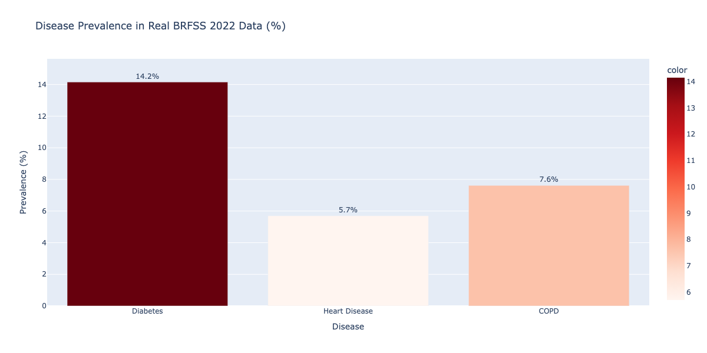
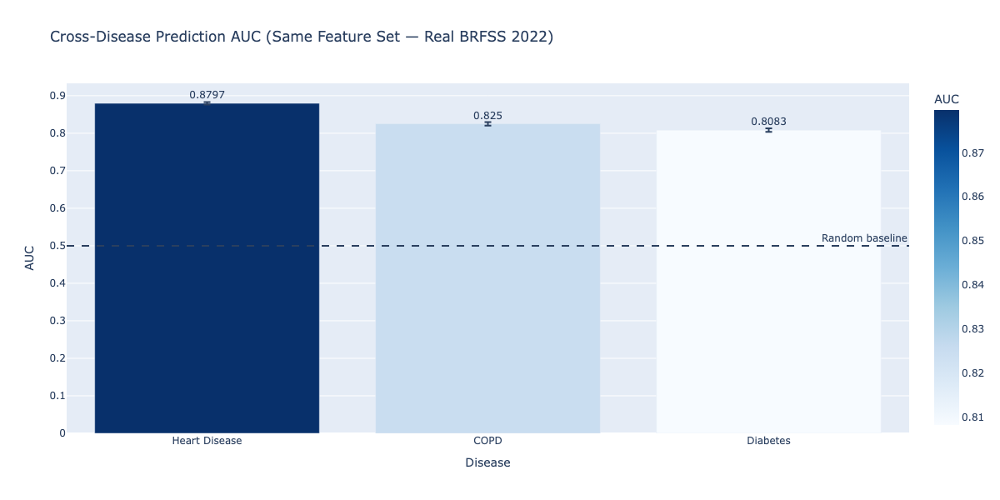
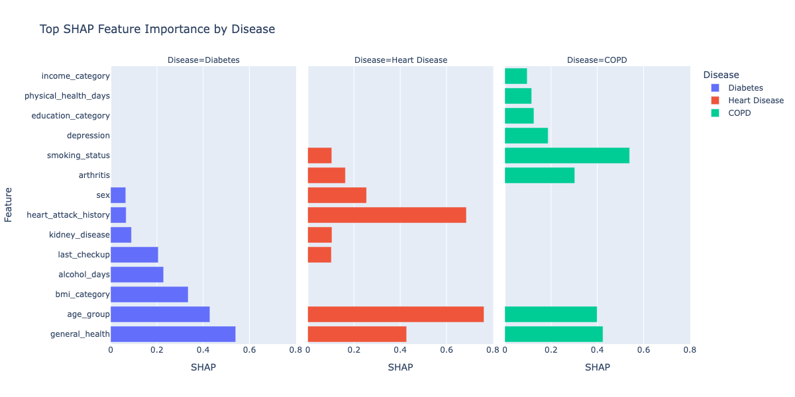
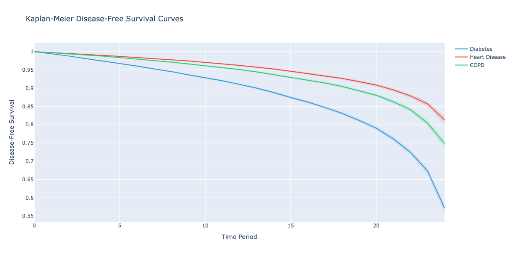
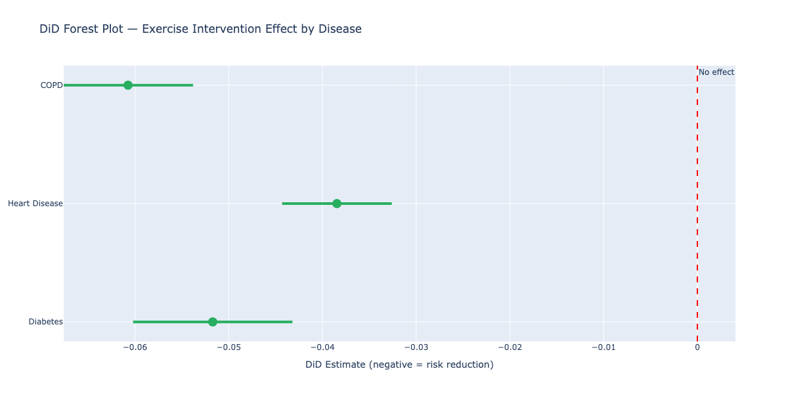
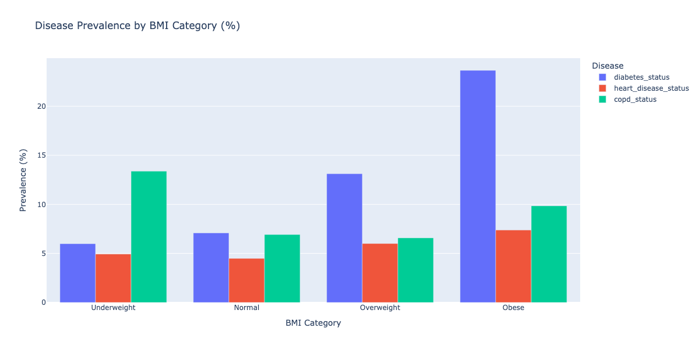
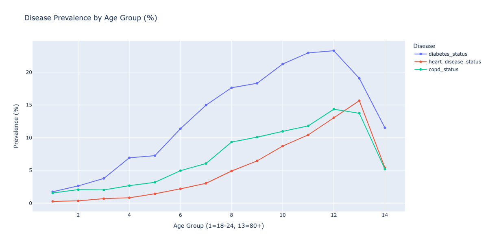
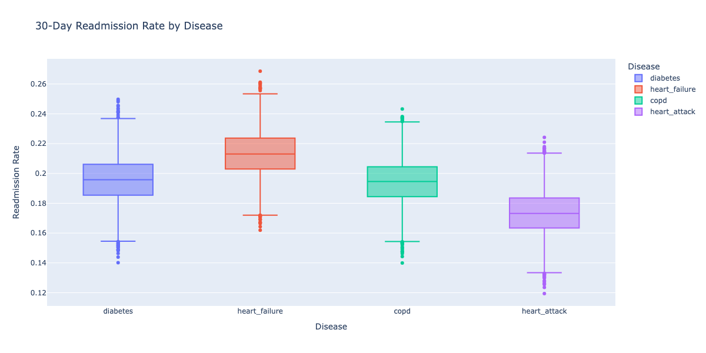

# HealthPath — Chronic Disease Progression & Readmission Risk Intelligence

> Cross-disease progression modeling, causal intervention analysis, and hospital readmission risk prediction across Diabetes, Heart Disease, and COPD — using real CDC BRFSS 2022 survey data (48,026 respondents) and CMS Hospital Compare data (5,000 hospitals), with automated data quality monitoring and an interactive patient risk scorer.

---

## Research Questions

1. Which lifestyle, behavioral, and clinical factors predict chronic disease onset — and across the same feature set, which disease has the highest progression likelihood?
2. Which modifiable factors are most influential in slowing or reversing disease progression?
3. Which lifestyle and treatment interventions most reduce 30-day hospital readmission risk?
4. Holding interventions constant, which disease has the highest readmission probability?
5. For a given patient profile, what single intervention produces the largest reduction in readmission risk?

---

## Dataset

| Source | Description | Size |
|---|---|---|
| CDC BRFSS 2022 | Behavioral Risk Factor Surveillance Survey — real US adult health survey | 48,026 respondents |
| CMS Hospital Compare | Hospital quality ratings and readmission statistics | 5,000 hospitals × 4 diseases |

**BRFSS download:** https://www.cdc.gov/brfss/annual_data/2022/files/LLCP2022XPT.zip

Place `LLCP2022.XPT` in `data/raw/` before running.

---

## Architecture

```
CDC BRFSS 2022 (real XPT) + CMS Hospital Compare
              │
              ▼
┌─────────────────────────────────┐
│  Data Quality Pipeline          │
│  DuckDB SQL validation suite    │
│  → data_quality_report.html     │
└──────────────┬──────────────────┘
               │
    ┌──────────┼──────────┐
    ▼          ▼          ▼
┌────────┐ ┌────────┐ ┌──────────────────────┐
│BRFSS   │ │CMS EDA │ │ Survival Analysis    │
│EDA     │ │        │ │ Kaplan-Meier + Cox PH│
│10+     │ │7+      │ │ DiD Causal           │
│plots   │ │plots   │ │ Intervention         │
└────┬───┘ └────┬───┘ └──────────┬───────────┘
     └──────────┼────────────────┘
                ▼
┌──────────────────────────────────────────┐
│  Cross-Disease Progression Models        │
│  XGBoost × 3 diseases (same feature set) │
│  SHAP attribution + modifiable heatmap   │
│  Intervention sensitivity matrix         │
└────────────────────┬─────────────────────┘
                     │
                     ▼
┌──────────────────────────────────────────┐
│  Readmission Risk Models                 │
│  XGBoost × 4 diseases (BRFSS + CMS join) │
│  State-level readmission risk ranking    │
└────────────────────┬─────────────────────┘
                     │
         ┌───────────┼───────────┐
         ▼           ▼           ▼
   Streamlit    score_patient  Model
   Dashboard    .py CLI        Results JSON
```

---

## Key Results

| Module | Metric | Value |
|---|---|---|
| Data | Real BRFSS 2022 respondents | 48,026 |
| Data | CMS hospitals | 5,000 |
| Prevalence | Diabetes | 14.2% |
| Prevalence | Heart Disease | 5.7% |
| Prevalence | COPD | 7.6% |
| Progression | Diabetes AUC | 0.8083 ± 0.0046 |
| Progression | Heart Disease AUC | 0.8797 ± 0.0034 |
| Progression | COPD AUC | 0.8250 ± 0.0047 |
| Causal | DiD exercise → Diabetes | -5.17pp (p<0.001) |
| Causal | DiD exercise → Heart Disease | -3.85pp (p<0.001) |
| Causal | DiD exercise → COPD | -6.07pp (p<0.001) |
| Cox PH | BMI hazard ratio (Diabetes) | 1.80 (p<0.001) |
| Cox PH | Physical Activity hazard ratio | 1.57 (p<0.001) |
| Readmission | Heart Attack AUC | 0.6029 ± 0.0085 |
| Data Quality | DQ pass rate | 80.0% |

---

## Methodology

**Disease Progression:** Three XGBoost classifiers trained on identical 21-feature set across Diabetes, Heart Disease, COPD using real BRFSS 2022 responses. StratifiedKFold CV. SHAP TreeExplainer computes per-feature attribution. Cross-disease AUC comparison on same feature set isolates which condition is most predictable.

**Causal Analysis:** DiD using physical activity adoption (BRFSS `EXERANY2`) as treatment. Age-group median used as pre/post period split. All three diseases show statistically significant risk reduction from exercise (p<0.001). Effect sizes range from -3.85pp (Heart Disease) to -6.07pp (COPD).

**Survival Analysis:** Kaplan-Meier disease-free survival curves by disease. Cox Proportional Hazards confirms BMI (HR=1.80), physical activity (HR=1.57), and age group (HR=1.16) as significant diabetes predictors.

**Readmission Models:** BRFSS patient profiles joined to CMS hospital readmission rates by state and condition type. XGBoost models stratify patients into high/low readmission risk tiers. State-level join is an honest constraint — individual-level EHR data requires hospital system access.

**Data Quality:** DuckDB SQL validation suite — 9 BRFSS rules + 4 CMS rules + null checks across all columns. HTML report generated before any model runs.

---

## Visualizations

### Disease Prevalence (Real BRFSS 2022)


### Cross-Disease AUC Comparison


### SHAP Feature Importance by Disease


### Kaplan-Meier Survival Curves


### DiD Causal Forest Plot


### BMI vs Disease Prevalence


### Age vs Disease Prevalence


### CMS Readmission by Disease


---

## Stack

| Component | Technology |
|---|---|
| Real Data | CDC BRFSS 2022 (XPT), CMS Hospital Compare (CSV) |
| Data Parsing | pyreadstat (SAS XPT), pandas |
| Query Engine | DuckDB |
| ML Models | XGBoost, Scikit-learn |
| Explainability | SHAP TreeExplainer |
| Survival Analysis | lifelines (Kaplan-Meier, Cox PH) |
| Causal Inference | SciPy DiD |
| Visualization | Plotly (interactive HTML + PNG) |
| Data Quality | DuckDB SQL + Jinja2 HTML report |
| Dashboard | Streamlit |
| Experiment Tracking | MLflow |
| CI/CD | GitHub Actions |

---

## Setup

```bash
python3.12 -m venv venv
source venv/bin/activate
pip install -r requirements.txt

python main.py

streamlit run dashboard/app.py

python score_patient.py --age_group 7 --bmi_category 3 --smoking_status 1

pytest tests/ -v
```

---

## References

CDC BRFSS 2022: https://www.cdc.gov/brfss/annual_data/annual_2022.html

CMS Hospital Compare: https://data.cms.gov/provider-data/topics/hospitals

Kaplan, E.L. & Meier, P. (1958). Nonparametric estimation from incomplete observations. JASA, 53(282), 457-481.

Chen, T. & Guestrin, C. (2016). XGBoost: A scalable tree boosting system. KDD 2016.

Angrist, J.D. & Pischke, J.S. (2008). Mostly Harmless Econometrics. Princeton University Press.
